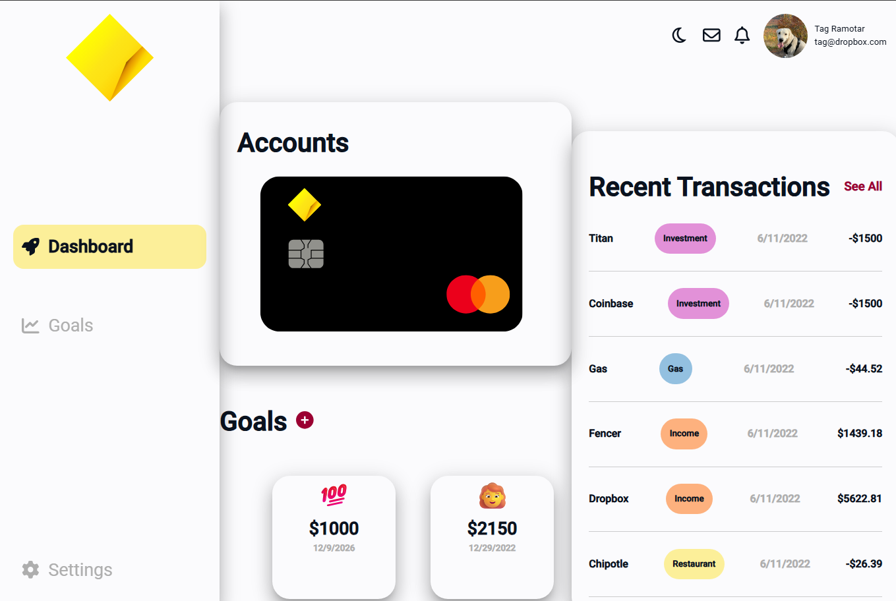
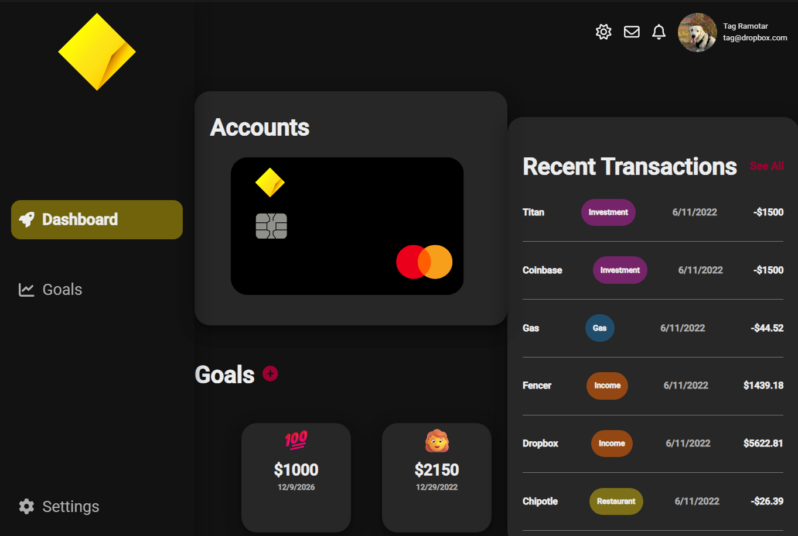

# CommBank Goal Tracker

A React + TypeScript dashboard for tracking savings goals, accounts, and recent transactions — built as part of the [CommBank frontend program](https://github.com/fencer-so/commbank-program).

<p align="center">
  
</p>
<p align="center">
  
</p>

## Features

- **Accounts overview** — at-a-glance card for the user's savings account
- **Goals** — create, rename, and track progress toward savings goals, each with a target amount and target date
- **Custom goal icons** — pick an emoji for any goal via an integrated [emoji-mart](https://github.com/missive/emoji-mart) picker, shown on both the goal card and the goal detail view
- **Recent transactions** — categorized list of the latest activity, tagged by type (Income, Investment, Restaurant, etc.)
- **Light / dark theme** — toggleable from the navbar, powered by `styled-components` theming

## Tech Stack

- [React](https://react.dev/) + TypeScript, bootstrapped with `react-scripts`
- [Redux Toolkit](https://redux-toolkit.js.org/) for state management
- [styled-components](https://styled-components.com/) for theming and styling
- [Material UI Pickers](https://material-ui-pickers.dev/) for date selection
- [emoji-mart](https://github.com/missive/emoji-mart) (v3) for the goal icon picker
- [Font Awesome](https://fontawesome.com/) for iconography

## Getting Started

```bash
# install dependencies
npm install

# start the app in development mode
npm start
```

The app runs at [http://localhost:3000](http://localhost:3000) by default.

Other available scripts:

```bash
npm run build   # production build
npm test        # run tests
npm run format  # format src/ with Prettier
```

## Project Structure

```
src/
├── api/          # API client and shared types (Goal, Account, Transaction, ...)
├── store/        # Redux slices (goals, modal, theme, user)
├── ui/
│   ├── components/   # Shared building blocks (Card, DatePicker, Theme, ...)
│   ├── features/     # Feature modules, e.g. goalmanager/ (icon picker, goal editing)
│   ├── pages/         # Page-level layout (Main dashboard: accounts, goals, transactions)
│   └── surfaces/      # Modal, drawer, navbar
└── assets/       # Images and static assets
```